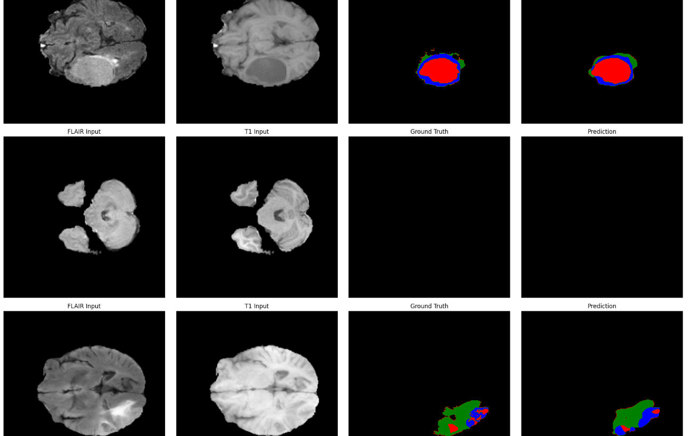
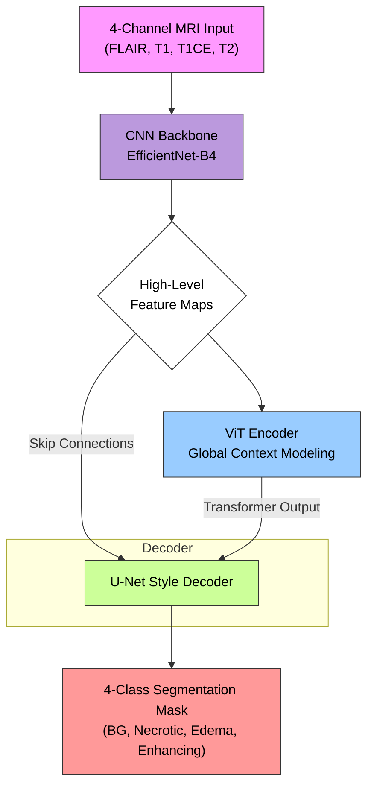

# TransUNet for Brain Tumor Segmentation on BraTS 2020

[](https://pytorch.org/get-started/locally/)
[](https://opensource.org/licenses/MIT)

This repository contains a PyTorch implementation of a **TransUNet-style hybrid vision transformer** for multi-class brain tumor segmentation on the BraTS 2020 dataset. The model leverages a CNN backbone for feature extraction and a transformer encoder for global context modeling, achieving a **0.825 Mean Dice Score** on the validation set.



## Performance

The model achieves strong performance across all three tumor sub-regions, with particularly precise segmentation of the Tumor Core (TC).

| Metric    | Enhancing Tumor (ET) | Tumor Core (TC) | Whole Tumor (WT) | **Average** |
| :-------- | :------------------: | :-------------: | :--------------: | :---------: |
| **Dice** |        0.8256        |   **0.8444** |      0.8053      |   0.8251    |
| **IoU** |        0.7747        |   **0.8043** |      0.7458      |   0.7749    |
| **HD95** |         6.22         |   **5.93** |       7.70       |   6.61      |

- **Best Performing Region (Dice):** Tumor Core (TC) at **0.8444**
- **Most Precise Boundaries (HD95):** Tumor Core (TC) at **5.93mm**

## Key Features

- **Hybrid Architecture**: Combines a pre-trained **EfficientNet-B4** CNN backbone with a **Vision Transformer (ViT)** to capture both local and global dependencies.
- **Advanced Training**: Implements mixed-precision training (FP16), gradient accumulation, gradient clipping, and a `CosineAnnealingWarmRestarts` learning rate scheduler.
- **Robust Loss Function**: Utilizes a custom `DiceFocalLoss` to effectively handle the severe class imbalance inherent in the BraTS dataset.
- **Efficient Data Handling**: Features a highly optimized `Dataset` class with patient-level caching and a `PatientSampler` to minimize I/O bottlenecks during training.
- **Reproducibility**: All hyperparameters and settings are centralized in `config/config.py` for easy modification and experimentation.
- **Comprehensive Evaluation**: Includes utilities for calculating standard segmentation metrics (Dice, IoU) and specialized BraTS metrics (HD95 for ET, TC, and WT regions).

## Quick Start

### 1. Prerequisites

- Python 3.9+
- NVIDIA GPU with CUDA 11.8+ support
- BraTS 2020 Training Dataset ([Request Access](https://www.med.upenn.edu/cbica/brats2020/registration.html))

### 2. Installation

```bash
# Clone the repository
git clone [https://github.com/yourusername/TransUNet_BraTs2020.git](https://github.com/yourusername/TransUNet_BraTs2020.git)
cd TransUNet_BraTs2020

# Create and activate a conda environment
conda env create -f environment.yaml
conda activate brats_segmentation
```

### 3. Dataset Setup
Download the BraTS 2020 training data and organize it as follows. The script will automatically find the patient folders inside the `MICCAI_BraTS2020_TrainingData` directory.

```
/path/to/your/data/
└── MICCAI_BraTS2020_TrainingData/
    ├── BraTS20_Training_001/
    │   ├── BraTS20_Training_001_flair.nii.gz
    │   ├── BraTS20_Training_001_t1.nii.gz
    │   ├── BraTS20_Training_001_t1ce.nii.gz
    │   ├── BraTS20_Training_001_t2.nii.gz
    │   └── BraTS20_Training_001_seg.nii.gz
    └── BraTS20_Training_002/
    └── ...
```

### 4. Training the Model

The main training script uses `argparse` to allow for flexible configuration. Point the script to your dataset path to begin training.

```bash
python train.py --data_path /path/to/your/data/MICCAI_BraTS2020_TrainingData
```

Training progress, logs, and model checkpoints will be saved in the `/kaggle/working/` directory (or as configured in `config.py`).

## Architecture Overview

The model fuses a CNN encoder with a Transformer to generate rich feature representations for a U-Net style decoder.



## Contributing
We welcome contributions! Please feel free to open an issue to discuss proposed changes or submit a pull request.

1.  Fork the repository.
2.  Create your feature branch (`git checkout -b feature/AmazingFeature`).
3.  Commit your changes (`git commit -m 'Add some AmazingFeature'`).
4.  Push to the branch (`git push origin feature/AmazingFeature`).
5.  Open a Pull Request.

## License

This project is licensed under the MIT License - see the [LICENSE](LICENSE) file for details.

## Citation

If you use this code in your research, please consider citing this repository:

```bibtex
@misc{TransUNetBraTS2020,
  author = {Your Name},
  title = {A Hybrid Transformer-CNN Architecture for Brain Tumor Segmentation},
  year = {2025},
  publisher = {GitHub},
  journal = {GitHub repository},
  howpublished = {\url{[https://github.com/yourusername/TransUNet_BraTs2020](https://github.com/yourusername/TransUNet_BraTs2020)}}
}
```
