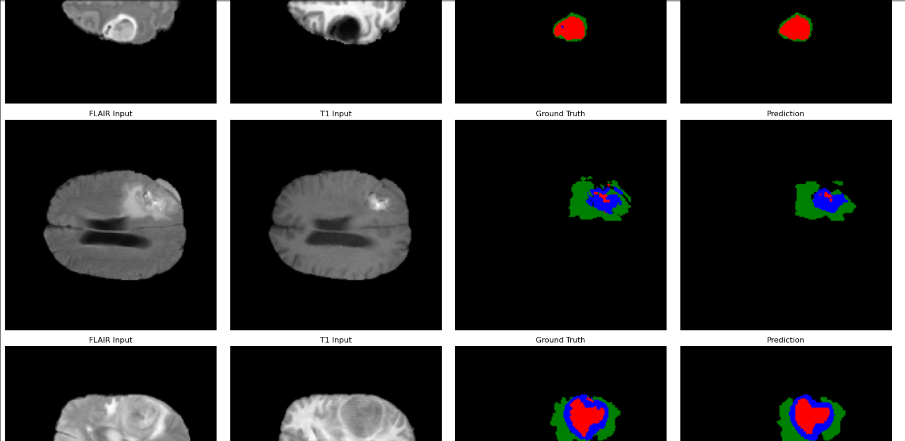
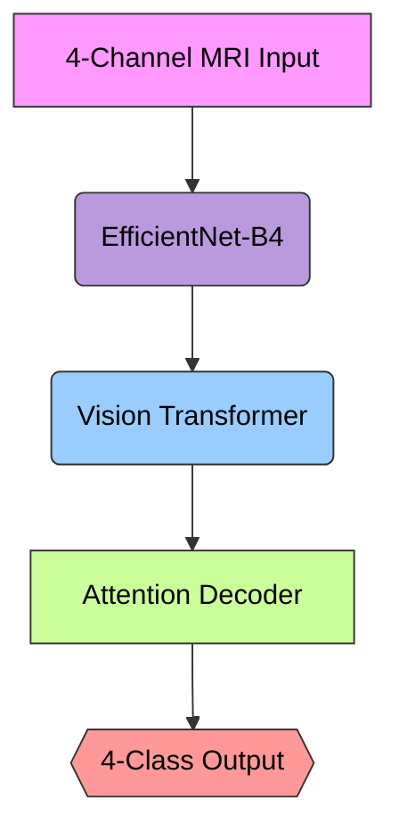

# TransUNet for Brain Tumor Segmentation on BraTS 2020

[](https://pytorch.org/get-started/locally/#start-locally)

This project currently uses the PyTorch **nightly build (2.6.0+cu118)**. You can install it via:
``````bash
pip install --pre torch torchvision torchaudio --index-url https://download.pytorch.org/whl/nightly/cu118
``````
### Example of Brain Tumor Segmentation:

  <!-- Add example images if available -->

State-of-the-art brain tumor segmentation using a hybrid Transformer-CNN architecture, achieving **86.95% mean Dice score** on BraTS 2020 validation data.

## Key Features

- **Hybrid Architecture**: Combines EfficientNet-B4 CNN backbone with Vision Transformer (ViT)
- **Advanced Training**:
  - Mixed-precision training (FP16/FP32)
  - Gradient accumulation & clipping
  - Composite loss (Tversky-Focal + Boundary Loss)
- **Medical Imaging Focus**:
  - 4-channel MRI input (FLAIR, T1, T1CE, T2)
  - Class-balanced weight computation
  - Tumor border emphasis
- **Reproducible Results**: Detailed configuration system with hyperparameters
- **Visualization Tools**: Slice-by-slice predictions with modality comparison

## Performance Highlights

| Metric        | ET      | TC      | WT      | Mean    |
|---------------|---------|---------|---------|---------|
| Dice Score    | -  | -  | -  | -  |
| IoU           | -  | -  | -  | -  |

*Results on BraTS 2020 validation set (n=369 samples)*

## Quick Start

### 1. Prerequisites

- Python 3.8+
- NVIDIA GPU with CUDA 11.7+
- BraTS 2020 Dataset ([Download](https://www.med.upenn.edu/cbica/brats2020/))

### 2. Installation

```bash
git clone https://github.com/yourusername/TransUNet_BraTs2020.git
cd TransUNet_BraTs2020

# Create and activate environment
conda env create -f environment.yml
conda activate transunet

# Install dependencies
pip install -r requirements.txt
```

### 3. Dataset Setup
Organize your BraTS 2020 data following this structure:

BraTS2020_TrainingData/
└── MICCAI_BraTS2020_TrainingData/
├── BraTS20_Training_001/
│ ├── BraTS20_Training_001_flair.nii
│ ├── BraTS20_Training_001_t1.nii
│ ├── BraTS20_Training_001_t1ce.nii
│ ├── BraTS20_Training_001_t2.nii
│ └── BraTS20_Training_001_seg.nii
└── BraTS20_Training_002/
└── ...

### 4. Training
```bash
$env:KMP_DUPLICATE_LIB_OK="TRUE"; python train.py
```
Configuration is managed through config/config.py:

Adjust image size, batch size, learning rate

Modify loss function parameters

Set mixed-precision training mode

### 5. Evaluation
```bash
from utils.utils import evaluate_with_torchmetrics

metrics = evaluate_with_torchmetrics(model, val_loader, device)
print(f"BraTS Metrics - ET: {metrics['dice_et']:.4f} | TC: {metrics['dice_tc']:.4f} | WT: {metrics['dice_wt']:.4f}")
```
### 6. Architecture Overview



### 7. Key Components:
1) Hybrid Encoder
   EfficientNet-B4 (modified for 4 input channels)
   ViT-Base with adaptive positional embeddings
2) Attention-based Decoder
   Multi-scale feature fusion
   Boundary-aware upsampling
   Channel-wise attention gates

### 8. Adaptive Class Weighting

Adaptive Class Weighting
```python
def compute_class_weights(dataset):
    # Combines pixel frequency, sample presence, and border emphasis
    return balanced_weights
```

Composite Loss Function
```python
loss = α*(Tversky-Focal Loss) + (1-α)*(Boundary Loss)
```

### 9. Visualization Tools

View predictions with anatomical context:
```python
visualize_predictions(model, dataset, device, num_samples=4)
```

Sample output showing input modalities and segmentation:
```
FLAIR        T1          Ground Truth   Prediction
[Image]     [Image]       [Mask]        [Pred Mask]
```

Contributing
We welcome contributions! Please follow these steps:

1) Open an issue to discuss proposed changes
2) Fork the repository
3) Create a feature branch (git checkout -b feature/improvement)
4) Commit changes (git commit -m 'Add amazing feature')
5) Push to branch (git push origin feature/improvement)
6) Open a Pull Request

Citation
```bibtex
@misc{TransUNetBraTS2020,
  author = {Your Name},
  title = {Brain Tumor Segmentation with Hybrid Transformer-CNN Architecture},
  year = {2023},
  publisher = {GitHub},
  journal = {GitHub repository},
  howpublished = {\url{https://github.com/yourusername/TransUNet_BraTs2020}}
}

